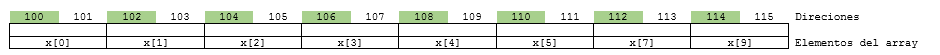

# Vectores y apuntadores - ejercicios

## 3. Ejercicios conceptuales

**Ejercicio 1**:

Suponga que se tiene el siguiente vector con las siguientes direcciones:


**Figura 1**. Vector inicial ejercicio 1

Adicionalemente, suponga que se declararon 3 apuntadores **p1**, **p2** y **p3** los cuales se encuentran en la direcciones **1000**, **2000** y **3000** respectivamente. Dadas las siguientes instrucciones:

```C
int *p1, *p2;
p1 = x;
p2 = &X[9];
*p2 = (*p2)*(-1)-(-1);
*p1 = 2*(*(p2-1))+*(p2-2);
p1++; // p1 = p1 + 1;
int *p3 = X + 3;
*p3 = *p3 + 1;
p2 = p3 + 2;
```

1. Dibuje el mapa de memoria asociado al problema anterior.
2  Despues de que se ejecuta el codigo anterior: Actualice el vector con los nuevos valores después de la ejecución del código anteriormente mostrado (**Nota**: no olvide resaltar el lugar apundado por los apuntadores):


**Figura 2**. Contenido del vector del ejercicio 1 despues de la ejecucion del codigo (Llenar).

Adicionalmente, llene el mapa de memoria con los nuevos valores tanto de los elementos del vector como de los apuntadores despues de la ejecucion del codigo.

3. Llene la siguiente tabla después de que se llevó a cabo la ejecución del código:

| Expresión  | Valor |
| ------------- | ------------- |
| &p1  |   |
| &p2  |   |
| &p3  |   |
| p1  |   |
| p2  |   |
| p3  |   |
| *p1  |   |
| *p2  |   |
| *p1  |   |
| *p1 + 1  |   |
| *(p1 + 1)  |   |
| p3 + 1  |   |
| p3 - 2  |   |

**Ejercicio 2**:
El proposito del siguiente codigo es que usted refuerce el concepto de llamadas por valor y por referencia. Observe el siguiente codigo:

```C
int f(int x, int y, int *z);

int main() {
  int a, b, c, d;
  int *p1, *p2 = &a, *p3 = &d;
  a = 2;
  b = -1;
  p2 = &c;  
  d = f(a + 3, b, &c);
  p1 = p2;
  // Parada 1...
  *p3 = f(*p2, -d, p1);
  // Parada 2...
  return 0;
}

int f(int x, int y, int *z) {
  *z = x + y;
  x++;  
  return *z + x + y;
}
```

Ahora responda las siguientes preguntas:

1. Llene la siguiente tabla con el contenido de las variables hasta que se llega al punto de parada 1 (Ver comentario en el codigo):


| Expresión  | Valor |
| ------------- | ------------- |
| a  |   |
| b  |   |
| c  |   |
| d  |   |
| *p1  |   |
| *p2  |   |
| *p3 |   |
| p1  |   |
| p2  |   |
| p3  |   |

2. Ahora llene la siguiente tabla con el contenido de las variables hasta que se llega al punto de parada 2 (Ver comentario en el codigo):

| Expresión  | Valor |
| ------------- | ------------- |
| a  |   |
| b  |   |
| c  |   |
| d  |   |
| *p1  |   |
| *p2  |   |
| *p3 |   |
| p1  |   |
| p2  |   |
| p3  |   |
